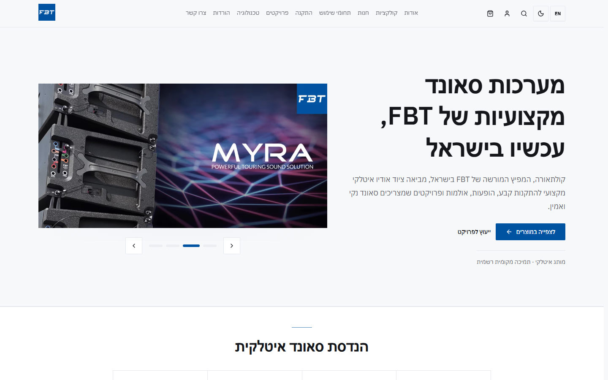
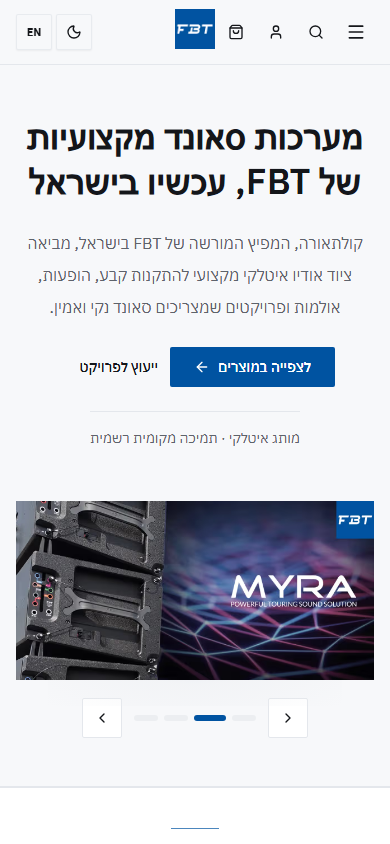
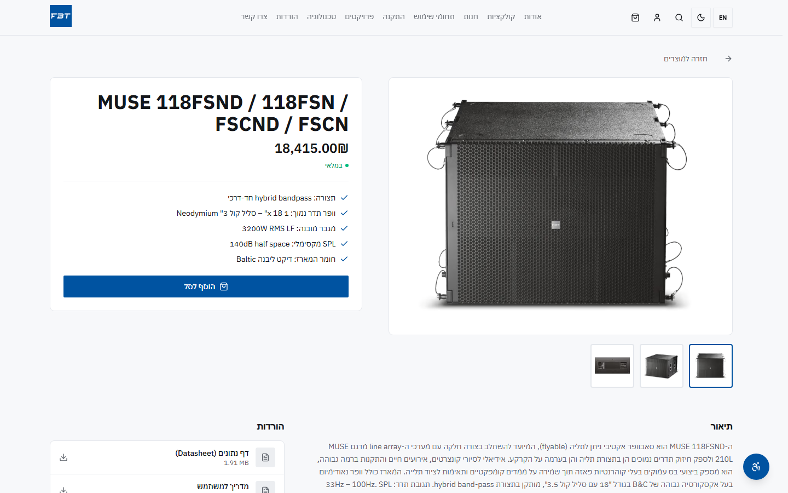
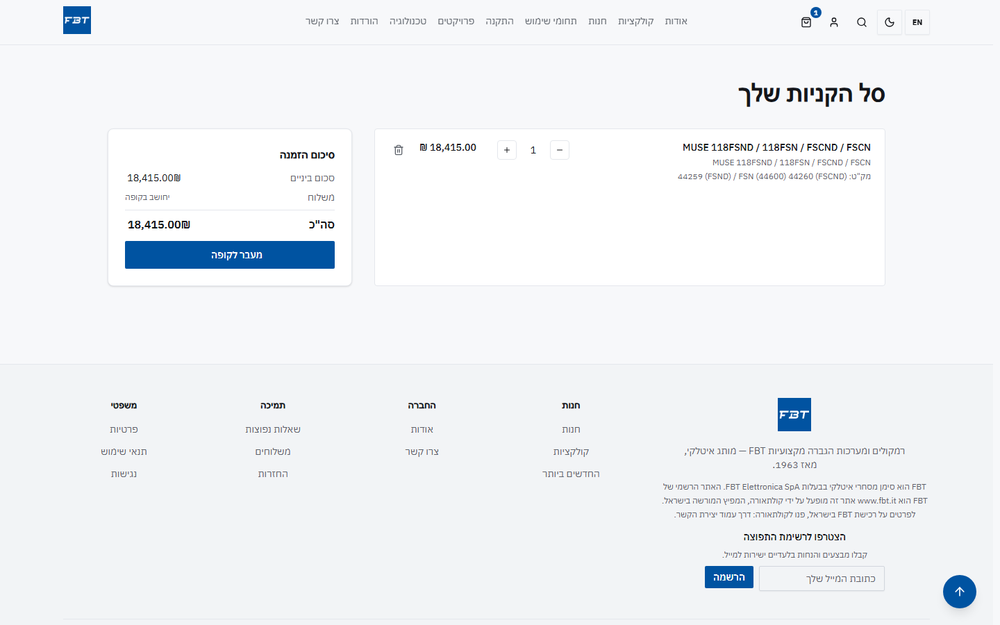
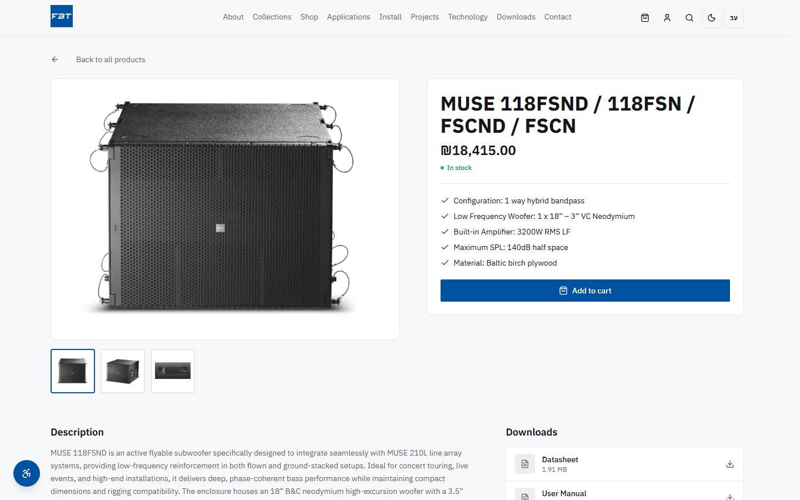

<div align="center">
  <h1>FBT Israel</h1>
  <p><strong>Bilingual E-Commerce Storefront — Hebrew RTL + English</strong></p>
  <p>A production Next.js 16 e-commerce platform built and shipped end-to-end for the official Israeli importer of FBT Elettronica, an Italian professional audio brand. Real card payments, a custom admin CMS, and full Hebrew/English RTL support — deployed on Vercel.</p>

  <br/>

  <a href="https://fbt-il.vercel.app/">
    
  </a>

  <br/><br/>

  
  
  
  
  
  
  
  
  
</div>

---

## Preview

<div align="center">
  <table>
    <tr>
      <td align="center" valign="top">
        
        <br/><sub><b>Homepage · Hebrew RTL</b></sub>
      </td>
      <td align="center" valign="top">
        
        <br/><sub><b>Homepage · Mobile RTL</b></sub>
      </td>
    </tr>
    <tr>
      <td align="center" valign="top">
        
        <br/><sub><b>Product Page · Hebrew RTL</b></sub>
      </td>
      <td align="center" valign="top">
        
        <br/><sub><b>Cart · Hebrew RTL</b></sub>
      </td>
    </tr>
    <tr>
      <td align="center" valign="top">
        
        <br/><sub><b>Homepage · English LTR</b></sub>
      </td>
      <td align="center" valign="top">
        
        <br/><sub><b>Product Page · English LTR</b></sub>
      </td>
    </tr>
  </table>
</div>

---

## About

**FBT Israel** (קולתאורה) is the production storefront for the official Israeli
importer of **FBT Elettronica**, an Italian professional audio manufacturer since
1963. Built for Agentical (agentical.agency) as their client's platform — I was the
sole engineer on the codebase. The source itself is private — this README is the
portfolio-facing summary covering the architecture, engineering decisions, and
screenshots that I can share publicly.

The site is bilingual — Hebrew (default, RTL) and English (LTR), toggled client-side
with no page reload. Unlike a typical single-market storefront, every user-facing
string, layout direction, and font is driven through a single i18n system rather than
hardcoded, so the two languages stay in lockstep as the catalog grows.

---

## How This Was Built

**AI-first**: I orchestrate AI coding agents (Claude Code, Codex) through a documented methodology rather than writing every line by hand — the engineering discipline is the point, not the speed.

- **`AGENTS.md` as the single source of truth** — a rules file in the repo defines the architecture, conventions, and hard constraints every agent must obey: money never in floats, every user-facing string routed through the bilingual i18n system (no hardcoded strings), independent server-side verification of every Tranzila payment before an order is marked paid.
- **Guardrail scripts & audit pipelines** — automated checks run on every change (RTL/LTR and i18n correctness, Server Action authorization, transactional-money rules), so quality is enforced by tooling, not vigilance.
- **The engineer decides, the agent executes** — every schema, payment flow, and architectural choice on this page was designed and reviewed by me. Agents accelerate implementation; they never own the design.

The result: one engineer delivering a production system at team-level velocity — with the discipline the decisions below reflect.

---

## Highlights

- **Real card payments** — Tranzila-powered hosted checkout, with independent
  server-side verification before any order is marked paid
- **Bilingual Hebrew/English RTL + LTR** with logical-property-only Tailwind
  (`ms-`/`me-`/`ps-`/`pe-`), a client-side language toggle, and a lint-time audit
  script that flags hardcoded UI strings
- **Custom admin CMS** — catalog, categories, coupons, homepage builder, FAQs,
  newsletter, marketing email broadcasts, and an audit log, all behind role-gated
  server actions
- **Server-authoritative cart** — signed HMAC cookie for anonymous shoppers,
  transactional merge into the user cart on login, nightly expiry sweep
- **Next.js 16 Dynamic IO caching** — `'use cache'` + tag-based invalidation for
  catalog/CMS reads; cart, checkout, and account data are never cached
- **No-floats money discipline** — `decimal.js` end to end, `numeric(10,2)` columns,
  a single `formatMoney` boundary for display
- **Feature-flagged integrations** — Tranzila, Resend, Sentry, Upstash rate limiting,
  and analytics are each Zod-validated and toggle-gated; the build fails fast on a
  misconfigured required variable
- **Order snapshotting** — every line item freezes `{ name, sku, image }` at purchase
  time, so historical orders survive later catalog edits or deletions
- **PWA** — offline-capable service worker generated at build time

---

## Tech Stack

| Layer            | Choice                                                                       |
| :---------------- | :----------------------------------------------------------------------------- |
| **Framework**      | Next.js 16 (App Router) + React 19 + TypeScript strict                          |
| **Styling**        | Tailwind CSS v4 + Radix UI + `motion/react`                                     |
| **Database**       | Supabase Postgres (pgBouncer transaction pool) + Drizzle ORM                    |
| **Auth**            | Supabase Auth (email + OAuth) with cookie-based SSR                              |
| **Payments**         | Tranzila (Israeli card gateway) — hosted checkout                  |
| **CMS**              | Custom admin panel — catalog, homepage builder, FAQs, dynamic pages                |
| **Rich Text**         | TipTap editor (admin-side content)                                                 |
| **Email**              | Resend + React Email (transactional + marketing broadcasts)                        |
| **Images**              | Sharp + `next/image`                                                                |
| **Forms**                | React Hook Form + Zod 4 (client) · Server Actions + Zod (server)                     |
| **DnD**                   | DnD Kit (sortable admin lists)                                                        |
| **Icons**                  | Lucide React                                                                            |
| **Money**                   | `decimal.js`, never native floats                                                       |
| **Error tracking**            | Sentry                                                                                   |
| **Rate limiting**               | Upstash Redis                                                                             |
| **Hosting**                       | Vercel                                                                                       |

---

## Architecture

```
                ┌──────────────────────────────────────────────┐
                │                   Vercel                      │
                │  Next.js 16 · App Router · React 19           │
                │                                               │
     client ──► │  (storefront)  marketing + shop               │
                │  (auth)        login / register / callback     │
                │  /admin/*      admin shell (RSC + actions)      │
                │  /api/*        Tranzila notify + form posts      │
                └──────┬─────────────────┬──────────────────┬───┘
                       │                 │                  │
                       ▼                 ▼                  ▼
             Supabase Postgres        Tranzila           Resend
             + Drizzle ORM            (payments, IL      (transactional
             (pgBouncer pool)         card gateway,      email)
                       │              hosted iframe)
                       ▼
             Supabase Auth · Supabase Storage
```

**Request flow**

1. Storefront reads are Server Components, cached with `'use cache'` + `cacheTag()`
   where the data is public and a mutation already owns invalidation.
2. Checkout creates a `pending` order server-side, hard-navigates the browser to
   Tranzila's hosted payment page — card details never touch this app's servers.
3. Payment results are confirmed server-side before an order is ever marked `paid`.
4. Admin mutations run through server actions gated by role checks, each one busting
   the cache tags it owns and writing an audit log entry.

---

## Major Systems

### Bilingual RTL / LTR
Hebrew is the default language and renders right-to-left; English renders left-to-right.
All user-facing strings live in per-language dictionaries — never hardcoded in
components — and Tailwind uses logical properties exclusively (`ms-`/`me-`/`ps-`/`pe-`,
`text-start`/`text-end`) so the same components mirror correctly in both directions.
A single font family (IBM Plex, Latin + Hebrew subsets) keeps typography consistent
across languages.

### Product Catalog & Inventory
Categories, product variants, rich specs, and a gallery per product. Each variant
tracks its own inventory row with a low-stock threshold; the storefront derives
`sold_out` / `low_stock` / `in_stock` badges directly from live quantity, and every
stock change (order, refund, manual adjustment) writes an append-only movement record.

### Cart & Checkout
The cart is server-authoritative — the client renders totals the server computed, it
never invents its own. Anonymous shoppers get a signed HMAC cookie backing a DB cart
row; on login, that cart merges transactionally into the user's cart. Checkout
re-validates the cart and any coupon server-side against the authoritative subtotal
before ever creating an order.

### Payments (Tranzila)
Card payments run through Tranzila's hosted checkout. Payment results are
independently verified server-side before an order is ever marked paid, and the
integration is built to safely handle duplicate or out-of-order delivery.

### Admin Panel
Role-gated dashboard covering catalog and category management, orders, customers,
coupons, a homepage builder, FAQs, newsletter subscribers, marketing email
broadcasts, site settings, and an audit log of every admin mutation.

### Email
Transactional order and account emails plus admin-triggered marketing broadcasts,
built with React Email and sent via Resend. Deliverability events (bounces,
complaints) arrive on a signature-verified webhook.

---

## Engineering Decisions Worth Highlighting

### Server-authoritative money, end to end
All pricing and discount math runs through `decimal.js`; Postgres stores money as
`numeric(10,2)`; the client only ever renders values the server already computed.
Native floating-point never touches a price.

### Next.js 16 Dynamic IO caching, deliberately scoped
`'use cache'` with an explicit `cacheTag` is used only where a mutation already owns
invalidation — catalog and CMS reads. Operational admin data and anything
cart/checkout-related is deliberately never cached, trading a little latency for
correctness where it matters most.

### Feature-flagged integrations with fail-fast validation
Every external service — payments, email, error tracking, rate limiting, analytics —
is gated behind a flag and Zod-validated at boot. A misconfigured required variable
fails the build immediately rather than surfacing as a runtime error in production.

### Order snapshotting
Every order line item freezes the product name, SKU, and image at purchase time.
Historical orders remain fully readable even if the underlying product is later
edited or removed from the catalog.

### Server-side authorization at three layers
Route-level middleware, page-level guards, and a per-action assertion inside every
admin server action — access control never relies on the client, and no single layer
is a single point of failure.

---

## Performance & Reliability

- `decimal.js` for all financial math; `numeric(10,2)` columns in Postgres
- Server Components stream a static shell immediately; uncached data loads inside
  `<Suspense>` boundaries under Next.js 16 Dynamic IO
- Tag-based cache invalidation for catalog/CMS reads — no full-site revalidation
- Rate limiting on public form endpoints (contact, newsletter) via Upstash
- Sentry error tracking across server, edge, and client runtimes
- Every foreign-key / status-filtered query path is indexed; admin search fields use
  trigram (`pg_trgm`) indexes
- Offline-capable PWA service worker generated at build time

---

<div align="center">

**Built by Sagi Menahem**

[](https://github.com/sagi-menahem)
[](https://www.linkedin.com/in/sagi-menahem/)
[](https://sagimenahem.tech)

</div>
